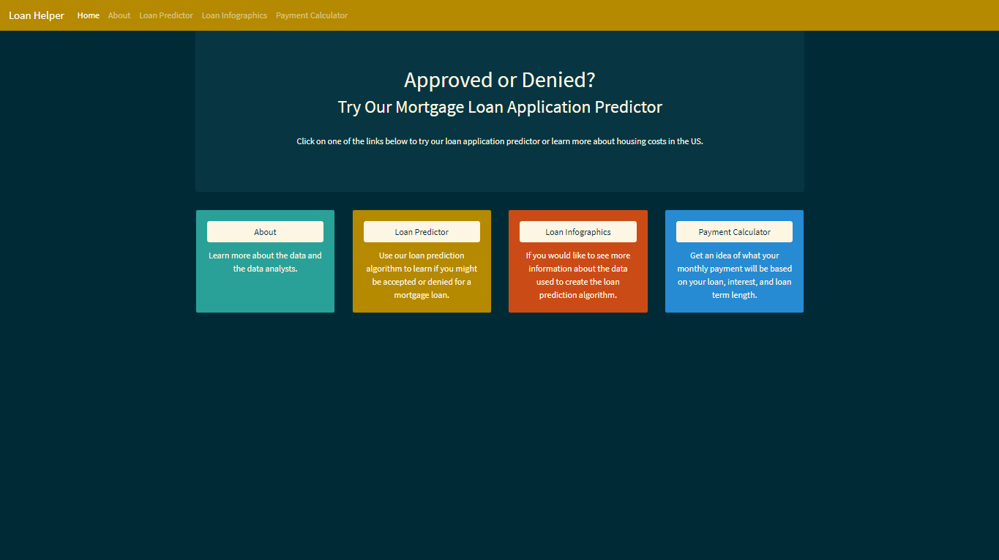

# Mortgage Predictor
### Contributors: Eric Evans, Mary Bellavia, Garrett DeBlois, Irene Zou

### [Heroku Deployment](https://washu-loan-helper.herokuapp.com/)
### [Powerpoint Presentation](https://docs.google.com/presentation/d/1YvpWaZ6Z7660EuGpmu68Yw7IGulIyOEd-zjV2looudo/edit?usp=sharing)

## The Data
* The visualizations and machine learning model was created using open source data provided by [Kaggle](https://www.kaggle.com/altruistdelhite04/loan-prediction-problem-dataset). 

## Data Cleaning
* **CHANGE THIS** Analysis on Zillow's rental and housing data includes the following:
  - working with the time series tables;
  - changes made to the data types and data formats;
  - organizing columns to a cleaner form;
  - acquire information from google geo api.

## Tableau Visualizations
[Tableau](https://public.tableau.com/profile/eric.evans4196#!/vizhome/project3_16190583513880/LoanFactorsDB2)

## Images
### Bubble Chart

### Line Graph

### House Heatmap

### Rent Heatmap

