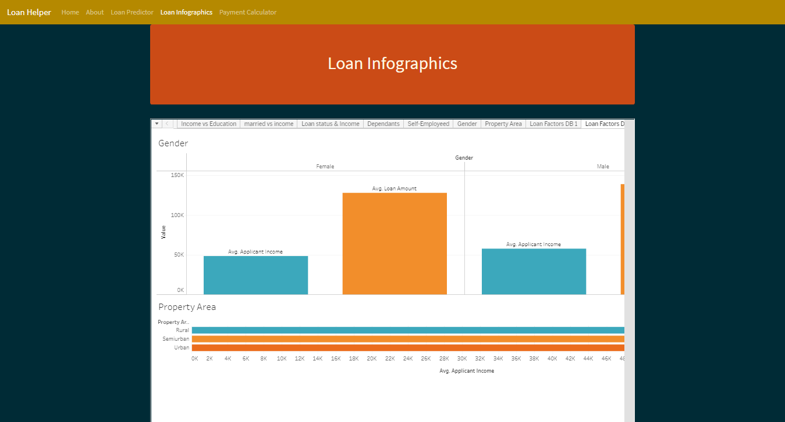

# Mortgage Predictor
### Contributors: Eric Evans, Mary Bellavia, Garrett DeBlois, Irene Zou

### [Heroku Deployment](https://washu-loan-helper.herokuapp.com/)
### [Powerpoint Presentation](https://docs.google.com/presentation/d/1YvpWaZ6Z7660EuGpmu68Yw7IGulIyOEd-zjV2looudo/edit?usp=sharing)

## The Data
* The visualizations and machine learning models were created using open source data provided by [Kaggle](https://www.kaggle.com/altruistdelhite04/loan-prediction-problem-dataset). 

## Data Cleaning
* Data preparation work for this loan prediction dataset includes the following:
  - dropping null values
  - changing data types to more appropriate types
  - multiplying values in loan amount and income columns to be in more human-readable formats

## Tableau Visualizations
Visualizations are powered by and hosted on [Tableau](https://public.tableau.com/profile/eric.evans4196#!/vizhome/project3_16190583513880/LoanFactorsDB2). The visualizations are related to factors considered when approving a loan. 
 Visualizations include information related to applicants such as:
* Area of property (rural vs. semiurban vs. urban)
* Gender
* Self-employed vs. not self-employed
* Number of dependents
* Marial status
* Education level

## Images
### Landing Page

### Loan Prediction Page

### Loan Infographics Page

### About Page

### Payment Calculator Page

